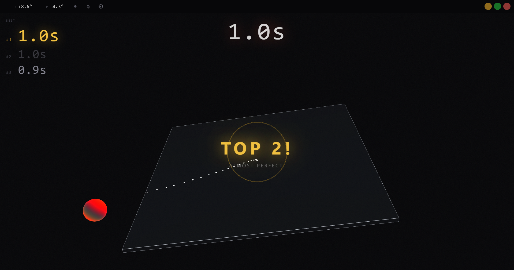

# Balance Lab

Premium sphere-on-platform balancing simulator built with Electron, React, Three.js, and `serialport`.



## Overview

Balance Lab is a desktop app that visualizes a rolling sphere on a tilting platform driven by live serial telemetry. The renderer focuses on a polished lab-demo presentation while the main process keeps a strict serial and parsing contract for incoming device data.

## Stack

- Electron
- React
- Three.js
- TypeScript
- `serialport`
- Vitest

## Development

```bash
npm install
npm run dev
```

## Available Scripts

```bash
npm run dev
npm run build
npm run preview
npm run test
npm run lint
npm run typecheck
```

## Serial Behavior

- Auto-connects to the first enumerated serial port
- Uses baud rate `1000000`
- Sends `start 104` and `gz` immediately after opening the port
- Accepts newline-delimited CSV telemetry
- Preserves firmware roll/pitch when present and clamps yaw to `0`

## Tests

```bash
npm run test
```
