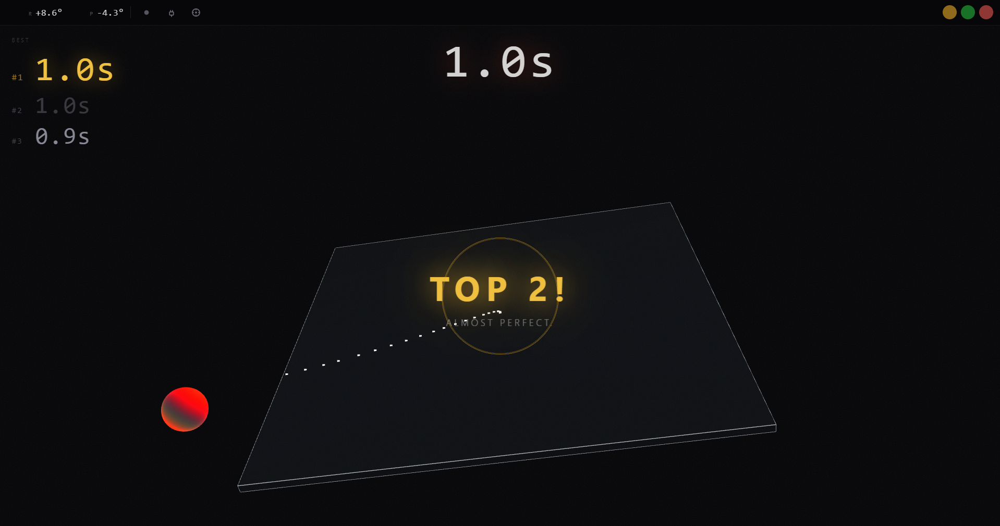

# Balance Lab

Sphere-on-platform balancing game built with Electron, React, Three.js, and `serialport`.



## Overview

Balance Lab is a desktop app that visualizes a rolling sphere on a tilting platform driven by live serial telemetry. The renderer focuses on a polished lab-demo presentation while the main process keeps a strict serial and parsing contract for incoming device data.

## Stack

- Electron
- React
- Three.js
- TypeScript
- `serialport`
- Vitest

## Development

```bash
npm install
npm run dev
```

## Available Scripts

```bash
npm run dev
npm run build
npm run preview
npm run test
npm run lint
npm run typecheck
npm run dist:win
```

## Windows app

Run `npm run dist:win` to build `dist/windows/Balance Lab-1.0.0-portable.exe`.
Double-click the executable to launch the game; no installation is needed.

Use **Difficulty** in the top bar to adjust the sphere from **0.25×** (easy) to **2.00×** (hard)
while playing. **1.00×** is the original speed and the default each time the app
opens. The slider supports dragging and arrow keys. Survival time remains in
real seconds, and sensor tilt and respawn timing are unchanged.

## Serial Behavior

- Auto-connects to the first enumerated serial port
- Uses baud rate `1000000`
- Sends `start 104` and `gz` immediately after opening the port
- Accepts newline-delimited CSV telemetry
- Preserves firmware roll/pitch when present and clamps yaw to `0`

## Tests

```bash
npm run test
```
